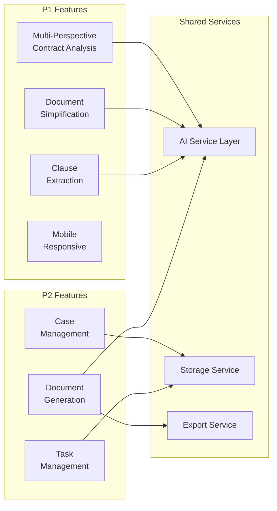

# Design Document: Competitive Advantage Features

## Overview

This design document outlines the technical architecture and implementation approach for enhancing DocketDive with competitive features derived from analysis of open-source legal-tech repositories. The design prioritizes P1 features (Multi-Perspective Contract Analysis, Document Simplification, Enhanced Clause Extraction, Mobile-Responsive Design) while providing a foundation for P2-P4 features.

## Architecture

### High-Level System Architecture

```mermaid
graph TB
    subgraph "Frontend (Next.js)"
        UI[React Components]
        Pages[App Router Pages]
        Hooks[Custom Hooks]
        Context[React Context]
    end
    
    subgraph "API Layer"
        ChatAPI[/api/chat]
        ContractAPI[/api/contract-analysis]
        SimplifyAPI[/api/simplify]
        ClauseAPI[/api/clauses]
        CaseAPI[/api/cases]
        TaskAPI[/api/tasks]
    end
    
    subgraph "AI Services"
        Groq[Groq API - Llama 3.3]
        Embeddings[HuggingFace Embeddings]
    end
    
    subgraph "Data Storage"
        LocalStorage[Browser LocalStorage]
        IndexedDB[IndexedDB]
    end
    
    UI --> Pages
    Pages --> Hooks
    Hooks --> Context
    Pages --> ChatAPI
    Pages --> ContractAPI
    Pages --> SimplifyAPI
    Pages --> ClauseAPI
    Pages --> CaseAPI
    Pages --> TaskAPI
    
    ChatAPI --> Groq
    ContractAPI --> Groq
    SimplifyAPI --> Groq
    ClauseAPI --> Groq
    
    Context --> LocalStorage
    CaseAPI --> IndexedDB
    TaskAPI --> IndexedDB
```

### Feature Module Architecture



## Components and Interfaces

### 1. Multi-Perspective Contract Analyzer

**Component:** `components/ContractPerspectiveAnalyzer.tsx`

```typescript
interface ContractAnalysis {
  perspective: 'party_a' | 'party_b' | 'neutral';
  riskScore: number; // 0-100
  favorableClauses: ClauseAnalysis[];
  riskyClauses: ClauseAnalysis[];
  modificationSuggestions: Suggestion[];
  summary: string;
}

interface ClauseAnalysis {
  clauseNumber: string;
  clauseText: string;
  category: ClauseCategory;
  riskLevel: 'low' | 'medium' | 'high';
  explanation: string;
  suggestedModification?: string;
}

interface Suggestion {
  clauseReference: string;
  currentText: string;
  suggestedText: string;
  rationale: string;
  priority: 'critical' | 'recommended' | 'optional';
}
```

**API Endpoint:** `POST /api/contract-analysis`

```typescript
interface ContractAnalysisRequest {
  content: string;
  perspective: 'party_a' | 'party_b' | 'neutral';
  contractType?: string;
}

interface ContractAnalysisResponse {
  analysis: ContractAnalysis;
  processingTime: number;
  generatedAt: string;
}
```

### 2. Document Simplifier

**Component:** `components/DocumentSimplifier.tsx`

```typescript
interface SimplificationResult {
  originalText: string;
  simplifiedSummary: string;
  clauseBreakdown: SimplifiedClause[];
  jargonGlossary: JargonTerm[];
  keyObligations: Obligation[];
  keyRights: Right[];
  keyDeadlines: Deadline[];
  flowchart?: FlowchartData;
  readabilityScores: {
    original: number; // Grade level
    simplified: number;
  };
}

interface SimplifiedClause {
  original: string;
  simplified: string;
  importance: 'critical' | 'important' | 'standard';
}

interface JargonTerm {
  term: string;
  definition: string;
  context: string;
}

interface FlowchartData {
  nodes: FlowchartNode[];
  edges: FlowchartEdge[];
}
```

**API Endpoint:** `POST /api/simplify`

```typescript
interface SimplifyRequest {
  content: string;
  includeFlowchart?: boolean;
  targetReadingLevel?: number; // Grade level (default: 8)
}
```

### 3. Enhanced Clause Extractor

**Component:** `components/ClauseExtractor.tsx`

```typescript
type ClauseCategory = 
  | 'termination'
  | 'indemnity'
  | 'confidentiality'
  | 'limitation_of_liability'
  | 'force_majeure'
  | 'governing_law'
  | 'dispute_resolution'
  | 'payment_terms'
  | 'warranties'
  | 'ip_rights'
  | 'non_compete'
  | 'assignment'
  | 'amendment'
  | 'notices'
  | 'entire_agreement'
  | 'other';

interface ExtractedClause {
  id: string;
  text: string;
  category: ClauseCategory;
  confidence: number; // 0-100
  isStandard: boolean;
  unusualLanguage?: string[];
  suggestedStandardText?: string;
}

interface ClauseExtractionResult {
  contractType: string;
  typeConfidence: number;
  clauses: ExtractedClause[];
  missingClauses: {
    category: ClauseCategory;
    importance: 'critical' | 'recommended' | 'optional';
    suggestedText: string;
  }[];
  summary: {
    totalClauses: number;
    categorizedClauses: number;
    unusualClauses: number;
    missingCritical: number;
  };
}
```

### 4. Case Management (P2)

**Component:** `components/CaseManager.tsx`

```typescript
interface Case {
  id: string;
  caseNumber?: string;
  title: string;
  clientName: string;
  caseType: CaseType;
  status: CaseStatus;
  description?: string;
  createdAt: string;
  updatedAt: string;
  deadlines: Deadline[];
  documents: DocumentRef[];
  notes: Note[];
}

type CaseType = 
  | 'civil_litigation'
  | 'criminal'
  | 'family'
  | 'commercial'
  | 'labour'
  | 'property'
  | 'estate'
  | 'other';

type CaseStatus = 'active' | 'pending' | 'closed' | 'on_hold';

interface Deadline {
  id: string;
  title: string;
  date: string;
  type: 'court_date' | 'filing_deadline' | 'meeting' | 'other';
  completed: boolean;
  notes?: string;
}
```

### 5. Task Management (P2)

**Component:** `components/TaskManager.tsx`

```typescript
interface Task {
  id: string;
  title: string;
  description?: string;
  caseId?: string;
  priority: 'low' | 'medium' | 'high' | 'urgent';
  status: 'todo' | 'in_progress' | 'completed';
  dueDate?: string;
  createdAt: string;
  completedAt?: string;
}

interface TaskStats {
  total: number;
  completed: number;
  overdue: number;
  dueToday: number;
  dueThisWeek: number;
}
```

## Data Models

### Storage Strategy

For a solo-dev MVP approach, we'll use browser-based storage:

1. **LocalStorage**: User preferences, settings, recent items
2. **IndexedDB**: Cases, tasks, documents (via Dexie.js wrapper)

```typescript
// lib/db.ts
import Dexie, { Table } from 'dexie';

interface DocketDiveDB extends Dexie {
  cases: Table<Case>;
  tasks: Table<Task>;
  documents: Table<StoredDocument>;
  clients: Table<Client>;
}

const db = new Dexie('DocketDiveDB') as DocketDiveDB;

db.version(1).stores({
  cases: '++id, status, clientName, caseType, createdAt',
  tasks: '++id, caseId, status, priority, dueDate',
  documents: '++id, caseId, type, createdAt',
  clients: '++id, name, email, phone'
});
```

### AI Prompt Templates

**Multi-Perspective Analysis Prompt (for Groq/Llama):**
```
You are a South African legal contract analyst. Analyze this contract from {perspective} perspective.

Contract:
{content}

Provide analysis in JSON format:
{
  "riskScore": <0-100>,
  "favorableClauses": [...],
  "riskyClauses": [...],
  "modificationSuggestions": [...],
  "summary": "..."
}

For Party A perspective: Focus on protecting Party A's interests, identifying risks to Party A.
For Party B perspective: Focus on protecting Party B's interests, identifying risks to Party B.
For Neutral perspective: Provide balanced analysis, highlight fairness issues for both parties.
```

**Document Simplification Prompt (for Groq/Llama):**
```
You are a legal document simplifier. Convert this legal document to plain language that a Grade 8 student could understand.

Document:
{content}

Provide:
1. A simplified summary (2-3 paragraphs)
2. Clause-by-clause breakdown with simplified explanations
3. List of legal jargon terms with plain definitions
4. Key obligations (what you must do)
5. Key rights (what you can do)
6. Key deadlines (when things must happen)
```

**Note:** All AI features use the existing Groq API integration (free tier: 14,400 requests/day). No additional API costs required.

## Correctness Properties

*A property is a characteristic or behavior that should hold true across all valid executions of a system—essentially, a formal statement about what the system should do. Properties serve as the bridge between human-readable specifications and machine-verifiable correctness guarantees.*

### Property 1: Perspective Analysis Output Structure

*For any* contract and any selected perspective (Party A, Party B, or Neutral), the Contract_Analyzer output SHALL contain: a risk score between 0-100, a non-empty array of favorable clauses, a non-empty array of risky clauses, and modification suggestions.

**Validates: Requirements 1.2, 1.3, 1.4, 1.5, 1.6**

### Property 2: Risk Score Range Validity

*For any* contract analysis result, the riskScore SHALL be a number between 0 and 100 inclusive.

**Validates: Requirements 1.6**

### Property 3: Case Data Round-Trip Persistence

*For any* valid case object with required fields (title, clientName, caseType, status), storing and then retrieving the case SHALL return an object with identical field values.

**Validates: Requirements 2.1, 2.2**

### Property 4: Case Status Filtering Correctness

*For any* set of cases with mixed statuses, filtering by a specific status SHALL return only cases where status equals the filter value.

**Validates: Requirements 2.3**

### Property 5: Deadline Warning Threshold

*For any* case deadline, if the deadline date is within 7 days of the current date and not in the past, the isApproaching flag SHALL be true.

**Validates: Requirements 2.4**

### Property 6: Case Age Calculation

*For any* case, the calculated age in days SHALL equal the difference between the current date and the createdAt date.

**Validates: Requirements 2.7**

### Property 7: Task Default Priority

*For any* task created without an explicit priority value, the priority SHALL default to "medium".

**Validates: Requirements 3.2**

### Property 8: Task Sorting Correctness

*For any* list of tasks sorted by due date, each task's due date SHALL be less than or equal to the next task's due date in the sorted list.

**Validates: Requirements 3.3**

### Property 9: Task Completion Timestamp

*For any* task transitioned to "completed" status, the completedAt field SHALL be set to a timestamp within 1 second of the transition time.

**Validates: Requirements 3.4**

### Property 10: Task Statistics Accuracy

*For any* set of tasks, the computed statistics SHALL satisfy: total = completed + incomplete, and overdue count equals the number of incomplete tasks with due dates in the past.

**Validates: Requirements 3.5, 3.6**

### Property 11: Overdue Task Detection

*For any* task with status not equal to "completed" and dueDate before the current date, the isOverdue computed property SHALL be true.

**Validates: Requirements 3.6**

### Property 12: Simplification Output Completeness

*For any* legal document submitted for simplification, the result SHALL contain: a non-empty simplifiedSummary, a clauseBreakdown array, a jargonGlossary array, and readabilityScores for both original and simplified versions.

**Validates: Requirements 4.1, 4.2, 4.3, 4.6**

### Property 13: Readability Score Improvement

*For any* document simplification result, the simplified readability score SHALL be less than or equal to the original readability score.

**Validates: Requirements 4.6**

### Property 14: Clause Extraction Non-Empty

*For any* contract with text content, the Clause_Extractor SHALL return at least one extracted clause.

**Validates: Requirements 5.1**

### Property 15: Clause Category and Confidence Validity

*For any* extracted clause, the category SHALL be one of the defined ClauseCategory enum values, and the confidence SHALL be a number between 0 and 100.

**Validates: Requirements 5.2, 5.3**

### Property 16: Missing Clause Suggestions

*For any* clause flagged as missing in the extraction result, the suggestedText field SHALL be a non-empty string.

**Validates: Requirements 5.4, 5.6**

### Property 17: Document Generation Validation

*For any* document template with N required fields, attempting to generate with fewer than N provided values SHALL return a validation error listing the missing fields.

**Validates: Requirements 9.5**

## Error Handling

### API Error Handling

```typescript
interface APIError {
  code: string;
  message: string;
  details?: Record<string, unknown>;
}

const errorCodes = {
  ANALYSIS_FAILED: 'Contract analysis failed. Please try again.',
  INVALID_DOCUMENT: 'Document format not supported. Please upload PDF, DOCX, or TXT.',
  AI_TIMEOUT: 'AI service timed out. Please try with a shorter document.',
  STORAGE_FULL: 'Local storage is full. Please delete some cases or documents.',
  NETWORK_ERROR: 'Network connection lost. Your data is saved locally.',
};
```

### Graceful Degradation

1. **Offline Mode**: Case and task management work offline via IndexedDB
2. **AI Fallback**: If Claude API fails, show cached results or suggest retry
3. **Storage Fallback**: If IndexedDB unavailable, fall back to LocalStorage with size warnings

## Testing Strategy

### Unit Tests

- Test clause categorization logic
- Test risk score calculation
- Test date/deadline calculations
- Test storage operations (CRUD)
- Test form validation

### Property-Based Tests

Using fast-check library for TypeScript:

```typescript
import fc from 'fast-check';

// Property 5: Case Data Persistence
test('case data persists after storage round-trip', () => {
  fc.assert(
    fc.property(
      fc.record({
        title: fc.string({ minLength: 1 }),
        clientName: fc.string({ minLength: 1 }),
        caseType: fc.constantFrom('civil_litigation', 'criminal', 'family'),
        status: fc.constantFrom('active', 'pending', 'closed'),
      }),
      async (caseData) => {
        const id = await db.cases.add(caseData);
        const retrieved = await db.cases.get(id);
        expect(retrieved).toMatchObject(caseData);
      }
    ),
    { numRuns: 100 }
  );
});

// Property 6: Task Status Transitions
test('task status follows valid transitions', () => {
  fc.assert(
    fc.property(
      fc.constantFrom('todo', 'in_progress', 'completed'),
      fc.constantFrom('todo', 'in_progress', 'completed'),
      (fromStatus, toStatus) => {
        const validTransitions = {
          todo: ['in_progress', 'completed'],
          in_progress: ['completed'],
          completed: [],
        };
        const isValid = validTransitions[fromStatus].includes(toStatus) || fromStatus === toStatus;
        expect(validateStatusTransition(fromStatus, toStatus)).toBe(isValid);
      }
    ),
    { numRuns: 100 }
  );
});
```

### Integration Tests

- Test full contract analysis flow
- Test document simplification pipeline
- Test case + task relationship
- Test export functionality

### E2E Tests (Playwright)

- Test mobile responsive behavior
- Test full user workflows
- Test offline functionality
