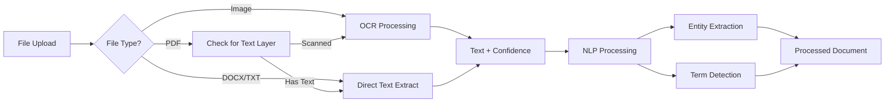

# Design Document: Open-Source Integrations

## Overview

This design document outlines the technical architecture for integrating open-source libraries (Tesseract.js, pdf.js, Compromise NLP) into DocketDive to enhance document processing capabilities. The design prioritizes client-side processing to minimize server load and enable offline functionality.

## Architecture

### High-Level System Architecture

```mermaid
graph TB
    subgraph "Frontend (Next.js)"
        UI[React Components]
        DocProcessor[Document Processor Service]
        PDFViewer[PDF Viewer Component]
        EntityPanel[Entity Sidebar]
    end
    
    subgraph "Client-Side Libraries"
        Tesseract[Tesseract.js OCR]
        PDFJS[pdf.js Renderer]
        Compromise[Compromise NLP]
    end
    
    subgraph "Existing Services"
        Upload[/api/upload]
        Simplify[/api/simplify]
        Audit[/api/audit]
        Contract[/api/contract-analysis]
    end
    
    UI --> DocProcessor
    DocProcessor --> Tesseract
    DocProcessor --> PDFJS
    DocProcessor --> Compromise
    
    DocProcessor --> Upload
    PDFViewer --> PDFJS
    EntityPanel --> Compromise
    
    Upload --> Simplify
    Upload --> Audit
    Upload --> Contract
```

### Document Processing Pipeline



## Components and Interfaces

### 1. OCR Service (Tesseract.js)

**Service:** `lib/ocr-service.ts`

```typescript
interface OCRResult {
  text: string;
  confidence: number; // 0-100
  blocks: TextBlock[];
  processingTime: number;
  language: 'eng' | 'afr';
}

interface TextBlock {
  text: string;
  confidence: number;
  bbox: BoundingBox;
  pageNumber: number;
}

interface BoundingBox {
  x0: number;
  y0: number;
  x1: number;
  y1: number;
}

interface OCROptions {
  language?: 'eng' | 'afr' | 'eng+afr';
  pageNumbers?: number[];
  onProgress?: (progress: OCRProgress) => void;
}

interface OCRProgress {
  status: 'loading' | 'recognizing' | 'complete';
  progress: number; // 0-1
  currentPage?: number;
  totalPages?: number;
}
```

**Implementation Notes:**
- Tesseract.js worker loaded lazily on first OCR request
- Worker cached for subsequent requests
- Language data files (~15MB each) loaded on demand
- Web Worker used to prevent UI blocking

### 2. PDF Viewer Component

**Component:** `components/PDFViewer.tsx`

```typescript
interface PDFViewerProps {
  file: File | string; // File object or URL
  onTextSelect?: (text: string, page: number) => void;
  highlights?: TextHighlight[];
  initialPage?: number;
  className?: string;
}

interface TextHighlight {
  id: string;
  text: string;
  page: number;
  color?: string;
  onClick?: () => void;
}

interface PDFViewerState {
  currentPage: number;
  totalPages: number;
  scale: number;
  isLoading: boolean;
  error: string | null;
}

// Exposed methods via ref
interface PDFViewerRef {
  goToPage: (page: number) => void;
  nextPage: () => void;
  prevPage: () => void;
  setScale: (scale: number) => void;
  fitToWidth: () => void;
  highlightText: (text: string, page: number) => void;
}
```

### 3. NLP Processor (Compromise)

**Service:** `lib/nlp-service.ts`

```typescript
interface ExtractedEntities {
  caseCitations: CaseCitation[];
  statuteReferences: StatuteReference[];
  parties: PartyEntity[];
  dates: DateEntity[];
  legalTerms: LegalTerm[];
}

interface CaseCitation {
  text: string;
  year?: number;
  volume?: string;
  page?: string;
  court?: string;
  position: TextPosition;
}

interface StatuteReference {
  text: string;
  actName: string;
  section?: string;
  subsection?: string;
  position: TextPosition;
}

interface PartyEntity {
  name: string;
  role: 'plaintiff' | 'defendant' | 'applicant' | 'respondent' | 'appellant' | 'other';
  position: TextPosition;
}

interface DateEntity {
  text: string;
  date: Date | null;
  type: 'deadline' | 'event' | 'reference';
  position: TextPosition;
}

interface LegalTerm {
  term: string;
  definition: string;
  isLatin: boolean;
  position: TextPosition;
}

interface TextPosition {
  start: number;
  end: number;
}
```

### 4. Enhanced Document Processor

**Service:** `lib/document-processor.ts`

```typescript
interface ProcessedDocument {
  id: string;
  fileName: string;
  fileType: 'pdf' | 'docx' | 'txt' | 'image';
  text: string;
  metadata: DocumentMetadata;
  entities: ExtractedEntities;
  ocrResult?: OCRResult;
  processingStages: ProcessingStage[];
}

interface DocumentMetadata {
  pageCount: number;
  wordCount: number;
  charCount: number;
  fileSize: number;
  isScanned: boolean;
  language: string;
}

interface ProcessingStage {
  name: string;
  status: 'pending' | 'processing' | 'complete' | 'error';
  progress: number;
  error?: string;
}

type ProcessingCallback = (stages: ProcessingStage[]) => void;
```

### 5. Legal Glossary Service

**Service:** `lib/legal-glossary.ts`

```typescript
interface GlossaryTerm {
  term: string;
  definition: string;
  category: 'latin' | 'procedural' | 'substantive' | 'custom';
  source?: string;
}

interface GlossaryService {
  getTerm: (term: string) => GlossaryTerm | null;
  searchTerms: (query: string) => GlossaryTerm[];
  addCustomTerm: (term: GlossaryTerm) => void;
  removeCustomTerm: (term: string) => void;
  getAllTerms: () => GlossaryTerm[];
}
```

## Data Models

### Storage Strategy

Custom glossary terms stored in localStorage:

```typescript
// localStorage key: 'docketdive_custom_glossary'
interface StoredGlossary {
  version: number;
  terms: GlossaryTerm[];
  updatedAt: string;
}
```

### Built-in Legal Glossary

```typescript
// data/legal-glossary.ts
const SA_LEGAL_TERMS: GlossaryTerm[] = [
  // Latin terms
  { term: "prima facie", definition: "At first appearance; on the face of it", category: "latin" },
  { term: "res judicata", definition: "A matter already judged; cannot be relitigated", category: "latin" },
  { term: "stare decisis", definition: "To stand by decided matters; precedent", category: "latin" },
  { term: "in limine", definition: "At the threshold; preliminary motion", category: "latin" },
  { term: "ex parte", definition: "From one side only; without the other party", category: "latin" },
  
  // SA-specific terms
  { term: "interdict", definition: "Court order prohibiting or compelling action (SA equivalent of injunction)", category: "procedural" },
  { term: "summons", definition: "Document initiating civil proceedings in Magistrate's Court", category: "procedural" },
  { term: "particulars of claim", definition: "Detailed statement of plaintiff's case", category: "procedural" },
  // ... more terms
];
```

### SA Case Citation Patterns

```typescript
// Regex patterns for SA case citations
const SA_CITATION_PATTERNS = [
  // Standard: 2023 (1) SA 123 (CC)
  /\d{4}\s*\(\d+\)\s*SA\s*\d+\s*\([A-Z]+\)/g,
  // BCLR: 2023 (1) BCLR 123 (CC)
  /\d{4}\s*\(\d+\)\s*BCLR\s*\d+\s*\([A-Z]+\)/g,
  // All SA: 2023 (1) All SA 123 (SCA)
  /\d{4}\s*\(\d+\)\s*All\s*SA\s*\d+\s*\([A-Z]+\)/g,
  // ZASCA format: [2023] ZASCA 123
  /\[\d{4}\]\s*ZA[A-Z]+\s*\d+/g,
];
```

## Correctness Properties

*A property is a characteristic or behavior that should hold true across all valid executions of a system—essentially, a formal statement about what the system should do. Properties serve as the bridge between human-readable specifications and machine-verifiable correctness guarantees.*

### Property 1: OCR Confidence Score Validity and Warning

*For any* OCR result, the confidence score SHALL be a number between 0 and 100, AND if confidence is below 70, a warning flag SHALL be set to true.

**Validates: Requirements 1.4, 1.5**

### Property 2: PDF Page Navigation Bounds

*For any* PDF document with N pages, navigating to page P where P > N SHALL result in currentPage = N, and navigating to page P where P < 1 SHALL result in currentPage = 1.

**Validates: Requirements 2.2**

### Property 3: Zoom Scale Bounds

*For any* zoom operation, the resulting scale SHALL be between 0.25 (25%) and 4.0 (400%).

**Validates: Requirements 2.3**

### Property 4: Entity Extraction Completeness

*For any* document containing SA case citations, statute references, party names, or dates, the NLP_Processor SHALL extract at least one entity of each present type, and each extracted entity SHALL have a non-empty type label.

**Validates: Requirements 3.1, 3.2, 3.3, 3.4, 3.5**

### Property 5: File Type Handling

*For any* uploaded file, if the file extension is in [pdf, docx, txt, png, jpg, jpeg], the Document_Processor SHALL accept it, AND if the file is an image type, OCR SHALL be automatically invoked.

**Validates: Requirements 4.1, 4.2**

### Property 6: Document Metadata Completeness

*For any* successfully processed document, the metadata SHALL contain non-negative values for pageCount, wordCount, charCount, and fileSize.

**Validates: Requirements 4.4**

### Property 7: Error Message Specificity

*For any* processing failure, the error message SHALL be a non-empty string containing at least one of: the failure stage name, the file type, or a recovery suggestion.

**Validates: Requirements 4.5**

### Property 8: Legal Term Detection

*For any* document text containing terms from the built-in glossary (including Latin phrases), the NLP_Processor SHALL identify at least 80% of the matching terms.

**Validates: Requirements 5.1, 5.5**

### Property 9: Custom Glossary Round-Trip

*For any* custom glossary term added by a user, retrieving the glossary SHALL return an entry with identical term and definition values.

**Validates: Requirements 5.6**

## Error Handling

### Error Types

```typescript
type DocumentProcessingError = 
  | { type: 'FILE_TOO_LARGE'; maxSize: number; actualSize: number }
  | { type: 'UNSUPPORTED_FORMAT'; format: string; supported: string[] }
  | { type: 'OCR_FAILED'; reason: string; suggestion: string }
  | { type: 'PDF_CORRUPTED'; suggestion: string }
  | { type: 'NLP_FAILED'; reason: string }
  | { type: 'NETWORK_ERROR'; suggestion: string };

const errorMessages: Record<string, string> = {
  FILE_TOO_LARGE: "File exceeds maximum size. Try compressing the PDF or splitting into smaller files.",
  UNSUPPORTED_FORMAT: "File format not supported. Please upload PDF, DOCX, TXT, or image files.",
  OCR_FAILED: "Text extraction failed. The document may be too blurry or damaged.",
  PDF_CORRUPTED: "PDF file appears corrupted. Try re-saving or re-scanning the document.",
  NLP_FAILED: "Entity extraction failed. The document will be processed without entity highlighting.",
  NETWORK_ERROR: "Network connection lost. Your document is saved locally and will process when reconnected.",
};
```

### Graceful Degradation

1. **OCR Failure**: Continue with empty text, show warning
2. **NLP Failure**: Continue without entity extraction, show warning
3. **PDF Render Failure**: Fall back to text-only view
4. **Library Load Failure**: Disable feature, show message

## Testing Strategy

### Unit Tests

- Test OCR confidence score calculation
- Test case citation regex patterns
- Test statute reference extraction
- Test page navigation bounds
- Test zoom scale bounds
- Test glossary CRUD operations

### Property-Based Tests

Using fast-check library for TypeScript:

```typescript
import fc from 'fast-check';

// Property 1: OCR Confidence Validity
test('OCR confidence is always 0-100 with correct warning', () => {
  fc.assert(
    fc.property(
      fc.integer({ min: 0, max: 100 }),
      (confidence) => {
        const result = processOCRResult({ confidence });
        expect(result.confidence).toBeGreaterThanOrEqual(0);
        expect(result.confidence).toBeLessThanOrEqual(100);
        expect(result.showWarning).toBe(confidence < 70);
      }
    ),
    { numRuns: 100 }
  );
});

// Property 2: Page Navigation Bounds
test('page navigation stays within bounds', () => {
  fc.assert(
    fc.property(
      fc.integer({ min: 1, max: 1000 }), // totalPages
      fc.integer({ min: -100, max: 1100 }), // requestedPage
      (totalPages, requestedPage) => {
        const result = navigateToPage(requestedPage, totalPages);
        expect(result).toBeGreaterThanOrEqual(1);
        expect(result).toBeLessThanOrEqual(totalPages);
      }
    ),
    { numRuns: 100 }
  );
});

// Property 4: Entity Extraction
test('extracted entities have type labels', () => {
  fc.assert(
    fc.property(
      fc.array(fc.record({
        text: fc.string({ minLength: 1 }),
        type: fc.constantFrom('citation', 'statute', 'party', 'date'),
      })),
      (entities) => {
        entities.forEach(entity => {
          expect(entity.type).toBeTruthy();
          expect(typeof entity.type).toBe('string');
        });
      }
    ),
    { numRuns: 100 }
  );
});
```

### Integration Tests

- Test full document processing pipeline
- Test PDF upload → OCR → NLP flow
- Test entity highlighting in PDF viewer
- Test glossary persistence across sessions

### E2E Tests (Playwright)

- Test drag-and-drop upload
- Test PDF viewer navigation
- Test entity sidebar interaction
- Test mobile touch gestures
